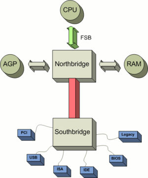

!SLIDE title-page

## CPU Caches

Jamie Allen

Chariot Day 2012

!SLIDE transition=fade
# Data Locality
.notes All algorithms are dominated by that - you have to send data somewhere to have an operation performed on it, and then you have to send it back to where it can be used. (Martin: The key thing with spatial is that data that is required together is located together.  This is especially important for what fields are required in a structure.  C preserves structure order but Java does not.  The best designs for Java/Scala are to make sure your object design is very cohesive so fields are in the appropriate objects.  With one client I got a 20% performance boost just by focusing on good cohesive design and measuring after.  Adjacent line cache fetching can help with this but also has an impact of false sharing.)

* Spatial - reused over and over in a loop, data accessed in small regions
* Temporal - high probability it will be reused before long

!SLIDE transition=fade
# Architecture
.notes Many machines today are SMP, a multiprocessor architecture where two or more identical processors are connected to a single shared main memory and controlled by a single OS instance.  Used to be that every socket had its own infrastructure that communicates with RAM via the frontside bus and northbridge.  (Martin: Ever since Intel's Nehalem CPU sockets have their own memory.  Another socket does not have access to the "global" RAM, it must go via the socket that owns the memory over the socket interconnect (QPI, HT, etc.).)  2011 Sandy Bridge and AMD Fusion integrated Northbridge functions into CPUs, along with processor cores, memory controller and graphics processing unit. So components are closer together today than depicted in this picture.

Image by Alexander Taubenkorb, Wikimedia Commons

!SLIDE transition=fade
# Memory Wall
.notes Gil Tene, CTO of Azul has a good presentation about this concept from a paper in 1994 on their website.  Each Intel core has 6 execution units able to perform work during a cycle (loading memory, storing memory, arithmetic, branch logic, shifting, etc), but they need to be fed data very fast to take advantage of it. Note that it didn't happen because of RAM, but the Application Memory Wall does exist in other forms, like GC pauses.  (Martin: with an application designed for low GC, you can hit the memory wall; but for middle of the road applications, Gil's point holds true.)

* CPUs are getting faster
* Memory isn't, and bandwidth is increasing at a much slower rate
* It was predicted that applications would become memory-bound by now
* Didn't happen

!SLIDE transition=fade
# Memory Controller
.notes Memory controller were moved onto the processor die by AMD beginning with their AMD64 processors and by Intel with their Nehalem processors.

* Handles communication between the CPU and RAM
* Contain the logic to read to and write from RAM
* Integrated Memory Controller

!SLIDE transition=fade
# Non-Uniform Memory Access (NUMA)
.notes NUMA architectures have more trouble migrating processes across cores.  Initially, it has to look for a core with the same speed accessing memory resources and enough resources for the process.  If none are found, it then allows for degradation.  NUMA is not the same as multiple commodity machines because they don't have a shared address space.  (Martin: On NUMA I'm finding that a typical application that is not NUMA aware can be made 20-40% faster just by setting socket affinity.  Most folk are totally unaware of this issue.  Thread migration on a NUMA box is mega costly because you don't even have an L3 cache warmed after the socket migration.)

* Access time is dependent on the memory locality to a processor
* Memory local to a processor can be accessed faster than memory farther away
* The organization of processors reflect the time to access data in RAM, called the NUMA factor.

!SLIDE transition=fade
# CPU or Instruction Cycle 
.notes sometimes called the fetch and execute cycle, or fetch-decode-execute cycle, or FDX.  Process by which a computer retrieves a program instruction from memory, determines what actions the instructions require, and carries out those actions.

* Basic operation cycle of a computer
* Sandy Bridge has 2 load/store operations for each memory channel

!SLIDE transition=fade
# Registers
.notes single cycle = 1/3 of a NS.

* On-core
* Can be accessed in a single cycle
* A 64-bit Intel Nehalem CPU has 128 Integer registers, 128 floating point registers

!SLIDE transition=fade
# Store Buffers
.notes Store buffers disambiguate memory access and manage dependencies for instructions (loads and stores) occurring out of program order. CPUs typically have load and store buffers which are associative queues of separate load and store instructions that are outstanding to the cache which can be snooped to preserve program order. 

* Load
* Store
* ~1 cycle

!SLIDE transition=fade
# SRAM

* Requires 6-8 pieces of circuitry per datum
* Runs at a cycle rate, not quite measurable in time
* Data does not fade or leak, does not need to be refreshed/recharged

# L0
.notes (Martin: Sandybridge also has a L0 instruction cache which is great for hot loops.  This is an "in core" cache of the last ~1.5K decoded uops (equivalent to 6K macro ops).  Macro ops have to be decoded into micro ops before being processed.  Nehalem would use the L1 cache for macro ops decoding all the time.  Sandybridge caches the uops for a nice perf boost in tight code.)

* Intel's Sandy Bridge architecture
* uops are Micro-Ops

!SLIDE transition=fade
# L1
.notes Instructions are generated by the compiler, which knows rules for good code generation.  Code has predictable patterns, & CPUs are good at recognizing them, helping pre-fetching.  And spatial and temporal locality is good.

* Divided into data and instructions
* 32K data, 32K instructions on a Sandy Bridge
* 3-4 cycles to get to L1d

!SLIDE transition=fade
# Line Feed/Write Combining Buffers
// TODO

!SLIDE transition=fade
# L2
.notes For random access, when the working set size is greater than the L2 size, cache misses start to grow.  Caches from L2 up are unified, having both instructions and data.

* Bigger, 256K per core on a Sandy Bridge
* 14 cycles
* Unified from here up

!SLIDE transition=fade
# L3
.notes where concurrency takes place, data is passed between cores on a socket.  Sandy Bridge is 4-30MB (8MB is currently max for mobile platforms), includes the processor graphics.  Processors "snoop" on each other, and certain actions are announced on external pins to make changes visible to others.  The address of the cache line is visible through the address bus

* Shared between cores
* Varies in size with different processors
* Uses Quick Path Interconnect links (QPI or HyperTransport) for cache coherency and snooping

!SLIDE transition=fade
# Exclusive versus Inclusive
.notes In an exclusive cache (AMD), when the processor needs data it is loaded by cache line into L1d, which evicts a line to L2, which evicts a line to L3, which evicts a line to main memory; each eviction is progressively more expensive.  In an inclusive cache (Intel), eviction is much faster, but requires a larger L2.  (Martin: The inclusive/exclusive of cache only applies to L1 and L2.  L3 is independent and pretty much always inclusive.)

* AMD is exclusive
* Intel is inclusive

!SLIDE transition=fade
# MESI+F Cache Coherency Protocol
.notes Request for Ownership (RFO): a cache line is held exclusively for read by one processor, but another requests for write.  Cache line is sent, but not marked shared by the original holder.  Instead, it is marked Invalid and the other cache becomes Exclusive.  This marking happens in the memory controller.  Performing this operation in the last level cache is expensive, as is the I->M transition.  If a Shared cache line is modified, all other views of it must be marked invalid via an announcement RFO message.  If Exclusive, no need to announce.  Processors will try to keep cache lines in an exclusive state, as the E to M transition is much faster than S to M.  RFOs occur when a thread is migrated to another processor and the cache lines have to be moved once, or when two threads absolutely must share a line; the costs ar a bit smaller when shared across two cores on the same processor.  MESI transitions cannot occur until all processors acknowledge a coherency message.  Collisions on the bus can happen, latenc can be high with NUMA systems, sheer traffic can slow things down - all reasons to minimize traffic.  Since code almost never changes, instruction caches do not use MESI but rather just a SI protocol.  If code does change, a lot of pessimistic assumptions have to be made by the controller.

* Modified, the local processor has changed the cache line, implies only one who has it
* Exclusive, only one processor is using the cache line, not modified
* Shared, multiple processors are using the cache line, not modified
* Invalid, the cache line is invalid (unused)
* Forward, to another socket via QPI
* Each QPI message takes ~20NS

!SLIDE transition=fade
# DRAM
.notes One transistor, one capacitor.  Reading contiguous memory is faster than random access due to how you read - you get one write combining buffer at a time from each of the memory banks, 33% slower.  240 cycles to get data from here.  (Martin: DRAM uses Row Buffers as you address a row of memory in a bank.)

* Very dense, only 2 pieces of circuitry per datum
* Refresh is just another read operation where the result is discarded & blocks access
* DRAM "leaks" its charge, but not sooner than 64 milliseconds
* Every read depletes the charge, requires a subsequent recharge
* Memory Controllers can "refresh" DRAM by sending a charge through the entire device
* Takes NS to retrieve from here

!SLIDE transition=fade
# DDR3 SDRAM

* Double Data Rate, Synchronous Dynamic
* Has a high-bandwidth three-channel interface
* Also reduces power consumption over DDR2 by 30%
* Data is transferred on the rising and falling edges of a 400-1066 MHz I/O clock of the system
* DDR4 is coming

!SLIDE transition=fade
# Cache Write Strategies
.notes Write through caching: immediately write to main memory after cache line changed. Slow, but predictable. Lots of FSB traffic.  Write back caching: mark flag bit as dirty, when evicted the processor notes and sends cache line back to main memory, instead of just dropping it; have to be careful of false sharing and cache coherency.  Write combining caching: used by graphics cards, groups writes to main memory for speed.  Uncachable: dynamic memory values that can change without warning.  Used for commodity hardware.

* Write through
* Write back
* Write combining
* Uncachable

!SLIDE transition=fade
# Cache Lines
.notes A dirty cache line is not present in any other processor's cache; clean copies of the same cache line can reside in arbitrarily many caches. A cache line that has been modified has a dirty flag set to true, set to false when sent to main memory.  Be careful about what's on them, because if a line holds multiple variables and the state of one changes, coherency must be maintained.  Kills performance for parallel threads on an SMP machine.  Memory data is transferred to caches in 64 bit blocks, while a cache line is typically 64 bytes, therefore 8 transfers per cache line.  The blocks of a line arrive at different times, ~every 4 CPU cycles.  If the word in the line required is in the last block, that's about 30 cycles or more after the first word arrives.  However, the memory controller is free to request the blocks in a different order.  The processor can specify the "critical word",  and the block that word resides in can be retrieved first for the cache line by the memory controller.  The program has the data it needs and can continue while the rest of the line is retrieved and the cache is not yet in a consistent state, called "Critical Word First & Early Restart.". Note that with pre-fetching, the critical word is not known - if the processor request the cach line while the pre-fetching is in transit, it will not be able to influence the block ordering and will hav to wait until the critical word arrives in order.  Position in the cache line matters, faster to be at the front than the rear.

* Most commonly 64 contiguous bytes, can be 32-256.  
* Look out for false sharing
* Padding can be used to ensure unshared line
* Position in the line matters
* @Contended annotation coming?

!SLIDE transition=fade
# Striding & Pre-fetching
.notes Doesn't have to be contiguous in an array, you can be jumping in 2K chunks without a performance hit.  As long as it's predictable, it will fetch the memory before you need it and have it staged.  Pre-fetching happens with L1d, can happen for L2 for systems with long pipelines.  Hardware prefetching cannot cross page boundaries, which slows it down as the working set size increases. If it did and the page wasn't there or valid, th OS would have to get involved and th program would experience a page fault it didn't initiate itself.  (Martin: Pre-fetching can actually hurt if your code is not predictable in access pattern.  Lines that may have temporal benefit get evicted by the pre-fetcher fetching line not to be used.)

* Predictable memory access is really important
* Hardware prefetcher on the core looks for patterns of memory access
* Can be counter-productive, believe it or not

!SLIDE transition=fade
# Cache Misses
.notes The pre-fetcher will bring data into L1 for you.  The simpler your code, the better it can do this.  If your code is complex, it will do it wrong, costing a cache miss and forcing it to lose the value of pre-fetching and having to go out to an outer layer to get that instruction again.  Cache eviction is usually LRU; with more associativity (from more cores), the cost of maintaining the list is more expensive.

* Cost hunderds of cycles
* Keep your code simple

!SLIDE transition=fade
# Hyperthreading
.notes Hyper threading shares all CPU resources except the register set.  Intel CPUs limit to two threads per core, allows one hyper thread to access resources (like the arithmetic logic unit) while another hyper thread is delayed, usually by memory access.  Only more efficient if the combined runtime is lower than a single thread, possible by overlapping wait times for different memory access that would ordinarily be sequential.  The only variable is the number of cache hits.  Note that the effectively shared L1d (& L2) reduce the available caches and bandwidth for each thread to 50% when executing two completely different code (questionable unless the caches are very large), inducing more cache misses, therefore hyper threading is only useful in a limited set of situations.  Can be good for debugging with SMT.

* Great for I/O-bound applications
* If you have lots of cache misses
* Doesn't do much for CPU-bound applications
* You have half of the cache resources per core

!SLIDE transition=fade
# Programming Optimizations
.notes Short lived data is not. Variables scoped within a method are stack allocated and very fast.  Think about the affect of contending locking.  You've got a warmed cache with all of the data you need, and because of contention (arbitrated at the kernel level), the thread will be put to sleep and your cached data is sitting until you can gain the lock from the arbitrator.  Due to LRU, it could be evicted.  The kernel is general purpose, may decide to do some housekeeping like defragging some memory, futher polluting your cache.  When your thread finally does gain the lock, it may end up running on an entirely different core and will have to rewarm its cache.  Everything you do will be a cache miss until its warm again.  CAS is better, an optimistic locking strategy.  Most version control systems use this.  Check the value before you replace it with a new value.  If it's different, re-read and try again.  Happens in user space, not at the kernel, all on thread.  Algos get a lot harder, though - state machines with many more steps and complexity.  And there is still a non-negligible cost.  Remember the cycle time diffs for different cache sizes; if the workload can be tailored to the size of the last level cache, performance can be dramatically improved.  (Martin: Program optimisation: For large n I would consider "cache oblivious algorithms".)

* Stack allocated data is cheap
* Pointer interaction - you have to retrieve data being pointed to, even in registers
* Avoid locking
* Match workload to the size of the last level cache

!SLIDE transition=fade
# What about Functional Programming?
.notes Eventually, caches have to evict.  Cache misses cost hundreds of cycles.

* Have to allocate more and more space for your data structures.  
* When you cycle back around, you get cache misses

!SLIDE transition=fade
# Data Structures
.notes  If n is not very large, an array will beat it for performance.  LL and trees have pointer chasing which are bad for striding across 2K cache pre-fetching.  Java's hashmap uses chained buckets, where each hash's bucket is a linked list.  Clojure/Scala vectors are good, because they have groupings of contiguous memory in use, but do not require all data to be contiguous like Java's ArrayList.  Fastutil is additive, no removal, but that's how I'm currently using Riak, too.

* BAD: Linked list structures and tree structures
* BAD: Java's HashMap uses chained buckets!
* BAD: Standard Java collections generate lots of garbage
* GOOD: Array-based and contiguous in memory is much faster
* GOOD: Write your own that are lock-free and contiguous
* Fastutil library

!SLIDE transition=fade
# Application Memory Wall & GC
.notes We can have as much RAM/heap space as we want now.  And requirements for RAM grow at about 100x per decade.  But are we now bound by GC?  You can get 100GB of heap, but how long do you pause for marking/remarking phases and compaction?  Even on a 2-4 GB heap, you're going to get multi-second pauses - when and how often?  IBM Metronome collector is very predictable. Azul around one millisecond for phenomenal amounts of garbage.

* Tremendous amounts of RAM at low cost
* But is GC the real cause?
* Use pauseless GC

!SLIDE transition=fade
# Using GPUs
.notes Graphics card processing (OpenCL) is great for specific kinds of operations, like floating point arithmetic. But they don't perform well for all operations, and you have to get the data to them.  

* Locality matters!
* Need to be able to export a task with data that does not need to update

!SLIDE transition=fade
# Manycore 
.notes number of cores is large enough that traditional multi-processor techniques are no longer efficient[citation needed] — largely because of issues with congestion in supplying instructions and data to the many processors.  Network-on-chip technology may be advantageous above this threshold

* David Ungar says > 24 cores, generally many 10s of cores
* Really trying to think about it with 1000 or more
* Cache coherency won't be possible

!SLIDE transition=fade
# `tor
.notes from HP, due to come out this year or next, may change memory fundamentally.  If the data and the function are together, you get the highest throughput and lowest latency possible.  Could replace DRAM and disk entirely.  When current flows in one direction through the device, the electrical resistance increases; and when current flows in the opposite direction, the resistance decreases.[1] When the current is stopped, the component retains the last resistance that it had, and when the flow of charge starts again, the resistance of the circuit will be what it was when it was last active.

* Non-volatile, static RAM, same write endurance as Flash (is that good enough for anything but storage?)
* 200-300 MB on chip
* Sub-nanosecond writes
* Able to perform processing
* Multistate, not binary

http://en.wikipedia.org/wiki/Memristor

!SLIDE transition=fade
# Credits

* Sources
	* [What Every Programmer Should Know About Memory](http://people.freebsd.org/~lstewart/articles/cpumemory.pdf)
		* Ulrich Drepper of RedHat, 2007
	* [Java Performance](http://www.amazon.com/Java-Performance-Charlie-Hunt/dp/0137142528/ref=sr_1_1?ie=UTF8&qid=1330796836&sr=8-1)
	* [Wikipedia/Wikimedia Commons](http://wikipedia.org/)
	* [Martin Thompson's Mechanical Sympathy blog and Disruptor presentations](http://mechanical-sympathy.blogspot.com/)
	* [Gil Tene, CTO of Azul Systems](http://www.azulsystems.com/presentations/application-memory-wall)

* Contributors
	* Martin Thompson provided feedback and additional content