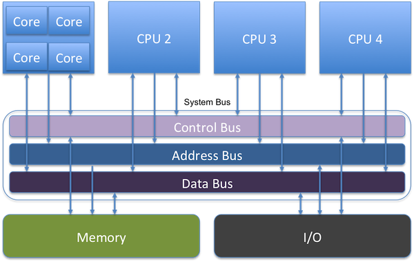

!SLIDE title-page
## CPU Caches
.notes More and more of our runtime environment is becoming virtual, but it is important as engineers for us to understand the low level details of hardware for our software to run optimally.  My goal is help everyone understand how each physical level of caching within a CPU works.  I've capped the talk below virtual memory (memory management for multitasking kernels), as that is specific to the operating system running on the machine.

Jamie Allen

jamie.allen@typesafe.com

@jamie_allen

github.com/jamie-allen

!SLIDE transition=blindY
# Why?

* Increased virtualization 
	* Runtime (JVM, RVM)
	* Platforms/Environments (cloud)
* Disruptor, 2011
	* http://code.google.com/p/disruptor/

!SLIDE transition=blindY
# Symmetric Multiprocessor (SMP) Architecture
.notes New machines today are SMP, a multiprocessor architecture where two or more identical processors are connected to a single shared main memory and controlled by a single OS instance.  2011 Sandy Bridge and AMD Fusion integrated Northbridge functions into CPUs, along with processor cores, memory controller and graphics processing unit.  So components are closer together today than depicted in this picture.

* Shared main memory, controlled by single OS
* No more Northbridge

!SLIDE transition=blindY
# Memory Controller
.notes Memory controllers were moved onto the processor die by AMD beginning with their AMD64 processors and by Intel with their Nehalem processors.

* Handles communication between the CPU and RAM
* Contain the logic to read to and write from RAM
* Integrated Memory Controller on die

!SLIDE transition=blindY
# Non-Uniform Memory Access (NUMA)
.notes NUMA architectures have more trouble migrating processes across cores.  Initially, it has to look for a core with the same speed accessing memory resources and enough resources for the process.  If none are found, it then allows for degradation.  NUMA is not the same as multiple commodity machines because they don't have a shared address space.  Thread migration across sockets is extremely expensive because the shared L3 cache isn't warmed.

* Access time is dependent on the memory locality to a processor
* Memory local to a processor can be accessed faster than memory farther away
* The organization of processors reflect the time to access data in RAM, called the NUMA factor
* Shared memory space (as opposed to multiple commodity machines)

!SLIDE transition=blindY
# Cache Lines
.notes A dirty cache line is not present in any other processor's cache; clean copies of the same cache line can reside in arbitrarily many caches. A cache line that has been modified has a dirty flag set to true, set to false when sent to main memory.  Be careful about what's on them, because if a line holds multiple variables and the state of one changes, coherency must be maintained.  Kills performance for parallel threads on an SMP machine.  Memory data is transferred to caches in 64 bit blocks, while a cache line is typically 64 bytes, therefore 8 transfers per cache line.  The blocks of a line arrive at different times, ~every 4 CPU cycles.  If the word in the line required is in the last block, that's about 30 cycles or more after the first word arrives.  However, the memory controller is free to request the blocks in a different order.  The processor can specify the "critical word",  and the block that word resides in can be retrieved first for the cache line by the memory controller.  The program has the data it needs and can continue while the rest of the line is retrieved and the cache is not yet in a consistent state, called "Critical Word First & Early Restart". Note that with pre-fetching, the critical word is not known - if the processor request the cache line while the pre-fetching is in transit, it will not be able to influence the block ordering and will have to wait until the critical word arrives in order.  Position in the cache line matters, faster to be at the front than the rear.

* Most commonly 64 contiguous bytes, can be 32-256
* Look out for false sharing
* Padding can be used to ensure unshared line
* Transferred in 64-bit blocks (8x for 64 byte lines), arriving every ~4 cycles
* Position in the line of the "critical word" matters, but not if pre-fetched
* @Contended annotation coming to JVM?

!SLIDE transition=blindY
# Cache Write Strategies
.notes Write through caching: immediately write to main memory after cache line changed. Slow, but predictable.  Lots of FSB traffic.  Write back caching: mark flag bit as dirty, when evicted the processor notes and sends cache line back to main memory, instead of just dropping it; have to be careful of false sharing and cache coherency.  Write combining caching: used by graphics cards, groups writes to main memory for speed.  Uncachable: dynamic memory values that can change without warning.  Used for commodity hardware.

* Write through - changed line immediately goes back to main memory
* Write back - line is marked when dirty, eviction sends back to main memory
* Write combining - grouped writes of cache lines back to main memory
* Uncachable - dynamic values that can change without warning

!SLIDE transition=blindY
# Current Processors
.notes Westmere was the 32nm die shrink of Nehalem.  Ivy Bridge uses 22nm.  I'm ignoring Oracle SPARC here, but note that Oracle is supposedly building a 16K core UltraSPARC 64.  Current Intel top of the line is Xeon E7-8870 (8 cores, 32MB L3, 4TB RAM), but it's a Westmere-based microarchitecture.  The E5-2600 Romley is the top shelf new Sandy Bridge offering - it's specs don't sound as mighty (8 cores per socket, max 30MB L3, 1TB RAM).  Don't be fooled, the Direct Data IO makes up for it as disks network cards can do DMA (Direct Memory Access) from L3, not RAM, decreasing latency by ~18%.  Also has two memory read ports, whereas previous architectures only had one and were a bottleneck for math-intensive applications.  Sandy Bridge is 4-30MB (8MB is currently max for mobile platforms, even with Ivy Bridge), includes the processor graphics.  Sandy/Ivy Bridge and Bulldozer support the new AVX (Advanced Vector Extensions) instruction set of x86.

* Intel
	* Nehalem/Westmere
	* Sandy Bridge
	* Ivy Bridge - not on servers yet
* AMD
	* Bulldozer
* Oracle
	* UltraSPARC isn't dead

!SLIDE transition=blindY
# Sandy Bridge Microarchitecture

!SLIDE transition=blindY
# CPU Caches
.notes Not to scale, not representative of the correct number of registers.

!SLIDE transition=blindY
# Data Locality
.notes All algorithms are dominated by that - you have to send data somewhere to have an operation performed on it, and then you have to send it back to where it can be used.  With spatial, what's important is that data which is required together is located together.  The JVM does not guarantee this for object instances, such as fields in a class.

* The most critical factor in performance
* Spatial - reused over and over in a loop, data accessed in small regions
* Temporal - high probability it will be reused before long

!SLIDE transition=blindY
# CPU or Instruction Cycle 

* aka Fetch and Execute Cycle
* aka Fetch-Decode-Execute Cycle (FDX)
* Retrieve instruction from memory, determine actions required and carry them out
* Equates to roughly 1/3 of a nanosecond

!SLIDE transition=blindY
# Latency Numbers Everyone Should Know
.notes The problem with these numbers is that while they're not far off, the lowest level cache interactions (registers, store buffers, L0, L1) are truly measured in cycles, not time.

	L1 cache reference ......................... 0.5 ns
	Branch mispredict ............................ 5 ns
	L2 cache reference ........................... 7 ns
	Mutex lock/unlock ........................... 25 ns
	Main memory reference ...................... 100 ns             
	Compress 1K bytes with Zippy ............. 3,000 ns  =   3 µs
	Send 2K bytes over 1 Gbps network ....... 20,000 ns  =  20 µs
	SSD random read ........................ 150,000 ns  = 150 µs
	Read 1 MB sequentially from memory ..... 250,000 ns  = 250 µs
	Round trip within same datacenter ...... 500,000 ns  = 0.5 ms
	Read 1 MB sequentially from SSD* ..... 1,000,000 ns  =   1 ms
	Disk seek ........................... 10,000,000 ns  =  10 ms
	Read 1 MB sequentially from disk .... 20,000,000 ns  =  20 ms
	Send packet CA->Netherlands->CA .... 150,000,000 ns  = 150 ms

	Shamelessly cribbed from this gist: https://gist.github.com/2843375

!SLIDE transition=blindY
# Measured Cache Latencies
.notes Sandy Bridge has 2 load/store operations for each memory channel

	Sandy Bridge-E			  L1d			L2			L3		  Main
							===========================================
	Sequential Access .....  3 clk        11 clk      14 clk        6ns
	Full Random Access ....  3 clk        11 clk      38 clk     65.8ns

	SI Software's benchmarks: http://www.sisoftware.net/?d=qa&f=ben_mem_latency

!SLIDE transition=blindY
# Registers
.notes Types of registers include instruction, data (floating point, integer, chars, small bit arrays, etc), address, conditional, constant, etc.

* On-core for instructions being executed and their operands
* Can be accessed in a single cycle
* There are many different types
* A 64-bit Intel Nehalem CPU had 128 Integer & 128 floating point registers

!SLIDE transition=blindY
# Load/Store Buffers
.notes Store buffers disambiguate memory access and manage dependencies for instructions (loads and stores) occurring out of program order. CPUs typically have load and store buffers which are associative queues of separate load and store instructions that are outstanding.

* Important for holding instructions for Out of Order (OoO) execution
* Can be snooped by other cores to preserve program order
* ~1 cycle

!SLIDE transition=blindY
# Cache Associativity
.notes It's a tradeoff - if data can be mapped to multiple places, all of those places have to be checked to see if the data is there, costing power and possibly time.  However, more associativity means less cache misses.

* Replacement policy determines where in the cache an entry of main memory will go
* Fully Associative: Put it anywhere
* Somewhere in the middle: 2-4 way set/skewed associative
* Direct Mapped: Each entry can only go in one specific place 

!SLIDE transition=blindY
# Static RAM (SRAM)
.notes The number of circuits per datum means that SRAM can never be dense.

* Requires 6-8 pieces of circuitry per datum, cannot be dense
* Runs at a cycle rate, not quite measurable in time
* Uses a relatively large amount of power for what it does
* Data does not fade or leak, does not need to be refreshed/recharged

!SLIDE transition=blindY
# L0
.notes Macro ops have to be decoded into micro ops to be handled by the CPU.  Nehalem used L1 for macro ops decoding and had a copy of every operand required, but Sandy Bridge caches the uops (Micro-operations), boosting performance in tight code (small, highly profiled and optimized, can be secure, testable, easy to migrate).  Not the same as the older "trace" cache, which stored uops in the order in which they were executed, which meant lots of potential duplication.  No duplication in the L0, storing only unique decode instructions.  Hot loops are those where the program spends the majority of its time.  Theoretical size of 1.5Kuops, effective utilization possibly much lower.  Hot loops should be sized to fit here.

* New to Sandy Bridge
* A cache of the last 1536 uops (~6kB) decoded
* Well-suited for hot loops
* Not the same as the older "trace" cache

!SLIDE transition=blindY
# L1
.notes Instructions are generated by the compiler, which knows rules for good code generation.  Code has predictable patterns and CPUs are good at recognizing them, which helps pre-fetching.  Spatial and temporal locality is good.  Nehalem could load 128 bits per cycle, but Sandy Bridge can load double that because load and store address units can be interchanged - thus using 2 128-bit units per cycle instead of one.

* Divided into data and instructions
* 32K data, 32K instructions per core on a Sandy Bridge
* Sandy Bridge loads data at 256 bits per cycle, double that of Nehalem
* 3-4 cycles to get to L1d

!SLIDE transition=blindY
# L2
.notes When the working set size random access is greater than the L2 size, cache misses start to grow.  Caches from L2 up are "unified", having both instructions and data (not in terms of shared across cores).

* 256K per core on a Sandy Bridge
* 2MB per "module" on AMD's Bulldozer architecture
* 11 cycles to reach
* Unified data and instruction caches from here up
* If the working set size is larger than L2, misses grow

!SLIDE transition=blindY
# L3
.notes Sandy Bridge allows only exclusive access per core.

* Was a unified cache up until Sandy Bridge, shared between cores
* Became known as the Last Level Cache (LLC)
* Where concurrency takes place
* Since no longer unified, any core could access data from any of the LLCs (until Sandy Bridge)
* Varies in size with different processors and versions of an architecture
* 14-38 cycles to reach

!SLIDE transition=blindY
# Exclusive versus Inclusive
.notes In an exclusive cache (AMD), when the processor needs data it is loaded by cache line into L1d, which evicts a line to L2, which evicts a line to L3, which evicts a line to main memory; each eviction is progressively more expensive.  In an inclusive cache (Intel), eviction is much faster - if another processor wants to delete data, it only has to check L2 because it knows L1 will have it as well.  Exclusive will have to check both, which is more expensive.

* Only relevant below L3
* AMD is exclusive
	* Progressively more costly due to eviction
	* Can hold more data
	* Bulldozer uses "write through" from L1d back to L2
* Intel is inclusive
	* Can be better for inter-processor memory sharing

!SLIDE transition=blindY
# Intra-Socket Communication
.notes Components internal to a CPU using the ring include the cores, the L3, the system agent and the graphics controller.  Used to require a specific channel for all linkages.

* Sandy Bridge introduced a ring architecture so that components inside of a CPU can communicate directly
* L3 is no longer unified, each core has a region
* The ring architecture in the Sandy Bridge has 4 rings in it, for data, request, ACK and snooping
* The ring can select the shortest path between components for speed

!SLIDE transition=blindY
# Inter-Socket Communication
.notes GT/s is gigatransfers per seconds - how many times signals are sent per second.  Not a bus, but a point to point interface for connections between sockets in a NUMA platform, or from processors to I/O and peripheral controllers.  DDR = double data rate, two data transferred per clock cycle.  HT could theoretically be up to 32 bits per transmission, but hasn't been done yet that I know of.  HT can be used for more than linking processors - has applications in as well.  Processors "snoop" on each other, and certain actions are announced on external pins to make changes visible to others.  The address of the cache line is visible through the address bus.  Sandy Bridge can transfer on both the rise & fall of the clock cycle and is full duplex.

* Uses Quick Path Interconnect links (QPI, Intel) or HyperTransport (AMD) for:
	* cache coherency across sockets
	* snooping
* QPI is proprietary to Intel.  Maximum speed of 8 GT/s
* Each QPI message takes ~20NS
* HyperTransport was developed by a consortium of AMD, NVidia, Apple, etc. Maximum speed of 6.4 GT/s (that I know of)
* Both are DDR and point to point interfaces to other CPUs in a NUMA setup
* Both transfer 16 bits per transmission in practice, but Sandy Bridge is really 32

!SLIDE transition=blindY
# MESI+F Cache Coherency Protocol
.notes Request for Ownership (RFO): a cache line is held exclusively for read by one processor, but another requests for write.  Cache line is sent, but not marked shared by the original holder.  Instead, it is marked Invalid and the other cache becomes Exclusive.  This marking happens in the memory controller.  Performing this operation in the last level cache is expensive, as is the I->M transition.  If a Shared cache line is modified, all other views of it must be marked invalid via an announcement RFO message.  If Exclusive, no need to announce.  Processors will try to keep cache lines in an exclusive state, as the E to M transition is much faster than S to M.  RFOs occur when a thread is migrated to another processor and the cache lines have to be moved once, or when two threads absolutely must share a line; the costs ar a bit smaller when shared across two cores on the same processor.  MESI transitions cannot occur until all processors acknowledge a coherency message.  Collisions on the bus can happen, latency can be high with NUMA systems, sheer traffic can slow things down - all reasons to minimize traffic.  Since code almost never changes, instruction caches do not use MESI but rather just a SI protocol.  If code does change, a lot of pessimistic assumptions have to be made by the controller.

* Specific to data cache lines
* Request for Ownership (RFO), when a processor tries to write to a cache line
* Modified, the local processor has changed the cache line, implies only one who has it
* Exclusive, only one processor is using the cache line, not modified
* Shared, multiple processors are using the cache line, not modified
* Invalid, the cache line is invalid, must be refetched
* Forward, to another socket via QPI
* All processors MUST acknowledge a message for it to be valid

!SLIDE transition=blindY
# Dynamic RAM (DRAM)
.notes One transistor, one capacitor.  Reading contiguous memory is faster than random access due to how you read - you get one write combining buffer at a time from each of the memory banks, 33% slower.  240 cycles to get data from here.  E7-8870 (Westhere) can hold 4TB of RAM, E5-2600 Sandy Bridge "only" 1TB.

* Very dense, only 2 pieces of circuitry per datum
* DRAM "leaks" its charge, but not sooner than 64 milliseconds
* Every read depletes the charge, requires a subsequent recharge
* Memory Controllers can "refresh" DRAM by sending a charge through the entire device
* Takes 240 cycles (100 NS) to retrieve from here
* Intel's Nehalem architecture - each CPU socket controls a portion of RAM, no other socket has direct access to it

!SLIDE transition=blindY
# DDR3 SDRAM

* Double Data Rate, Synchronous Dynamic
* Has a high-bandwidth three-channel interface
* Also reduces power consumption over DDR2 by 30%
* Data is transferred on the rising and falling edges of a 400-1066 MHz I/O clock of the system
* DDR4 is coming

!SLIDE transition=blindY
# Striding & Pre-fetching
.notes Doesn't have to be contiguous in an array, you can be jumping in 2K chunks without a performance hit.  As long as it's predictable, it will fetch the memory before you need it and have it staged.  Pre-fetching happens with L1d, can happen for L2 in systems with long pipelines.  Hardware prefetching cannot cross page boundaries, which slows it down as the working set size increases. If it did and the page wasn't there or is invalid, the OS would have to get involved and the program would experience a page fault it didn't initiate itself.  Temporally relevant data may be evicted fetching a line that will not be used.

* Predictable memory access is really important
* Hardware prefetcher on the core looks for patterns of memory access
* Can be counter-productive if the access pattern is not predictable

!SLIDE transition=blindY
# Cache Misses
.notes The pre-fetcher will bring data into L1d for you.  The simpler your code, the better it can do this.  If your code is complex, it will do it wrong, costing a cache miss and forcing it to lose the value of pre-fetching and having to go out to an outer layer to get that instruction again.  Cache eviction is usually LRU; with more associativity (from more cores), the cost of maintaining the list is more expensive.  Compulsory/Capacity/Conflict are miss types.

* Cost hunderds of cycles
* Keep your code simple
* Instruction read misses are most expensive
* Data read miss are less so, but still hurt performance
* Write misses aren't so bad unless the policy is "write through"

!SLIDE transition=blindY
# Programming Optimizations
.notes Short lived data is not cheap, but variables scoped within a method running on the JVM are stack allocated and very fast.  Think about the affect of contending locking.  You've got a warmed cache with all of the data you need, and because of contention (arbitrated at the kernel level), the thread will be put to sleep and your cached data is sitting until you can gain the lock from the arbitrator.  Due to LRU, it could be evicted.  The kernel is general purpose, may decide to do some housekeeping like defragging some memory, futher polluting your cache.  When your thread finally does gain the lock, it may end up running on an entirely different core and will have to rewarm its cache.  Everything you do will be a cache miss until its warm again.  CAS is better, checking the value before you replace it with a new value.  If it's different, re-read and try again.  Happens in user space, not at the kernel, all on thread.  Algos get a lot harder, though - state machines with many more steps and complexity.  And there is still a non-negligible cost.  Remember the cycle time diffs for different cache sizes; if the workload can be tailored to the size of the last level cache, performance can be dramatically improved.  Note that for large data sets, you may have to be oblivious to caching.

* Stack allocated data is cheap
* Pointer interaction - you have to retrieve data being pointed to, even in registers
* Avoid locking and resultant kernel arbitration
* CAS is better and all on-thread, but algorithms become more complex
* Match workload to the size of the last level cache (LLC, L3)

!SLIDE transition=blindY
# What about Functional Programming?
.notes Eventually, caches have to evict.  Cache misses cost hundreds of cycles.

* Have to allocate more and more space for your data structures, leads to eviction
* When you cycle back around, you get cache misses
* Choose immutability by default, profile to find poor performance
* Use mutable data in targeted locations

!SLIDE transition=blindY
# Hyperthreading
.notes Hyper threading shares all CPU resources except the register set.  Intel CPUs limit to two threads per core, allows one hyper thread to access resources (like the arithmetic logic unit) while another hyper thread is delayed, usually by memory access.  Only more efficient if the combined runtime is lower than a single thread, possible by overlapping wait times for different memory access that would ordinarily be sequential.  The only variable is the number of cache hits.  Note that the effectively shared L1d (& L2) reduce the available caches and bandwidth for each thread to 50% when executing two completely different code (questionable unless the caches are very large), inducing more cache misses, therefore hyper threading is only useful in a limited set of situations.  Can be good for debugging with SMT.  Contrast this with Bulldozer's "modules" (akin to two cores), which has dedicated schedulers and integer units for each thread in a single processer.

* Great for I/O-bound applications
* If you have lots of cache misses
* Doesn't do much for CPU-bound applications
* You have half of the cache resources per core

!SLIDE transition=blindY
# Data Structures
.notes  If n is not very large, an array will beat it for performance.  Linked lists and trees have pointer chasing which are bad for striding across 2K cache pre-fetching.  Java's hashmap uses chained buckets, where each hash's bucket is a linked list.  Clojure/Scala vectors are good, because they have groupings of contiguous memory in use, but do not require all data to be contiguous like Java's ArrayList.  Fastutil is additive, no removal, but that's not necessarily a bad thing with proper tombstoning and data cleanup.

* BAD: Linked list structures and tree structures
* BAD: Java's HashMap uses chained buckets!
* BAD: Standard Java collections generate lots of garbage
* GOOD: Array-based and contiguous in memory is much faster
* GOOD: Write your own that are lock-free and contiguous
* GOOD: Fastutil library, but note that it's additive

!SLIDE transition=blindY
# Application Memory Wall & GC
.notes We can have as much RAM/heap space as we want now.  And requirements for RAM grow at about 100x per decade.  But are we now bound by GC?  You can get 100GB of heap, but how long do you pause for marking/remarking phases and compaction?  Even on a 2-4 GB heap, you're going to get multi-second pauses - when and how often?  IBM Metronome collector is very predictable. Azul around one millisecond for lots of garbage with C4.

* Tremendous amounts of RAM at low cost
* GC will kill you with compaction
* Use pauseless GC
	* IBM's Metronome, very predictable
	* Azul's C4, very performant

!SLIDE transition=blindY
# Using GPUs
.notes Graphics card processing (OpenCL) is great for specific kinds of operations, like floating point arithmetic. But they don't perform well for all operations, and you have to get the data to them.  

* Locality matters!
* Need to be able to export a task with data that does not need to update

!SLIDE transition=blindY
# Manycore 
.notes number of cores is large enough that traditional multi-processor techniques are no longer efficient[citation needed] — largely because of issues with congestion in supplying instructions and data to the many processors.  Network-on-chip technology may be advantageous above this threshold

* David Ungar says > 24 cores, generally many 10s of cores
* Really trying to think about it with 1000 or more
* Cache coherency won't be possible
* Non-deterministic

!SLIDE transition=blindY
# Memristor
.notes from HP, due to come out this year or next, may change memory fundamentally.  If the data and the function are together, you get the highest throughput and lowest latency possible.  Could replace DRAM and disk entirely.  When current flows in one direction through the device, the electrical resistance increases; and when current flows in the opposite direction, the resistance decreases.  When the current is stopped, the component retains the last resistance that it had, and when the flow of charge starts again, the resistance of the circuit will be what it was when it was last active.  Is write endurance good enough for anything but storage?

* Non-volatile, static RAM, same write endurance as Flash
* 200-300 MB on chip
* Sub-nanosecond writes
* Able to perform processing
* Multistate, not binary

!SLIDE transition=blindY
# Phase Change Memory (PRAM)
.notes Thermally-driven phase change, not an electronic process.  Faster because it doesn't need to erase a block of cells before writing.  Flash degrades at 5000 writes per sector, where PRAM lasts 100 million writes.  Some argue that PRAM should be considered a memristor as well.

* Higher performance than today's DRAM
* Intel seems more fascinated by this, just released its "neuromorphic" chip design
* Not able to perform processing
* Write degradation is supposedly much slower
* Was considered susceptible to unintentional change, maybe fixed?

!SLIDE transition=blindY
# Credits

* [What Every Programmer Should Know About Memory, Ulrich Drepper of RedHat, 2007](http://people.freebsd.org/~lstewart/articles/cpumemory.pdf)
* [Java Performance](http://www.amazon.com/Java-Performance-Charlie-Hunt/dp/0137142528/ref=sr_1_1?ie=UTF8&qid=1330796836&sr=8-1)
* [Wikipedia/Wikimedia Commons](http://wikipedia.org/)
* [AnandTech](http://www.anandtech.com/)
* [The Microarchitecture of AMD, Intel and VIA CPUs](http://www.agner.org/optimize/microarchitecture.pdf)
* [Everything You Need to Know about the Quick Path Interconnect, Gabriel Torres](http://www.hardwaresecrets.com/article/610)

!SLIDE transition=blindY
# Credits

* [Inside the Sandy Bridge Architecture, Gabriel Torres](http://www.hardwaresecrets.com/printpage/Inside-the-Intel-Sandy-Bridge-Microarchitecture/1161)
* [Martin Thompson's Mechanical Sympathy blog and Disruptor presentations](http://mechanical-sympathy.blogspot.com/)
* [Gil Tene, CTO of Azul Systems](http://www.azulsystems.com/presentations/application-memory-wall)
* [AMD Bulldozer/Intel Sandy Bridge Comparison by Gionatan Danti](http://www.ilsistemista.net/index.php/hardware-analysis/24-bulldozer-vs-sandy-bridge-vs-k10-comparison-whats-wrong-with-amd-bulldozer.html)
* [SI Software's Benchmarks](http://www.sisoftware.net/?d=qa&f=ben_mem_latency)
* Martin Thompson and Cliff Click provided feedback and additional content